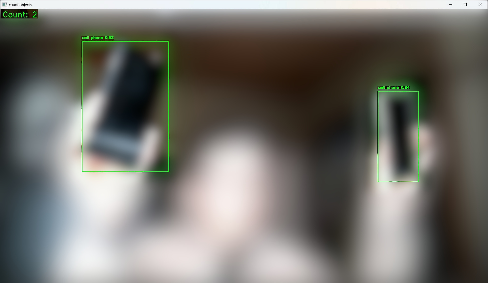

[README in English](readme.md)

## prototype-countobjectについて
WEBカメラの映像からオブジェクトの検出を行うプロトタイプソフトです。  
open-cv、PyTorch、YOLOv5を利用しています。  

## 注意点
- 他の環境でも動作するとは思いますが、GeforceのGPUを搭載したWindowsPCでのみ確認しています  
- ライブラリのダウンロードに1GB以上の通信を行います。高速/低コストな通信環境で実行してください  
- ライブラリ全体で1.6GBくらいのディスクスペースを必要とします  
- 初回起動時のみ事前学習済みのモデルyolov5s.ptのダウンロードが行われるため少し余計に時間がかかります  

## インストール方法（知識のある方向け）
#### 必要なライブラリ
    pip install torch torchvision opencv-python ultralytics

#### 実行方法
    py prototype-countobject.py

## インストール方法（簡易な方法Windows用）
[簡易インストール版zipのダウンロード]  
    https://github.com/nekotodance/prototype-countobject/releases/download/latest/prototype-countobject.zip  

- Pythonのインストール（SD標準の3.10.6推奨）  
- zipファイルを解凍  
- 解凍したフォルダ内の「install.ps1」を右クリックして「PowerShellで実行」を選択  
- リンクファイルのダブルクリックで起動できます  

## 利用方法
#### 準備
ソースの以下の部分を利用するWebカメラにあわせて修正してください。  

- WEBCUM_DEVICE_ID  
WEBカメラのデバイスIDを指定。  
仮想カメラなどにも割り振られるので、0から順番に試してください。  
- WEBCUM_WIDTH, WEBCUM_HEIGHT  
WEBカメラの映像サイズを指定。  
FullHDなら1920,1080、HDなら1280,720など利用するWebカメラに合わせて指定してください。  
- WEBCUM_FPS  
WEBカメラのfpsを指定。  
60、30、24など利用するWebカメラに合わせて指定してください。  

#### 検出対象
ソースの以下の部分を検出するオブジェクトにあわせて修正してください。  
target_classes = ["cup", "cell phone"]  

※デフォルトではコップと携帯電話を対象としています  

#### キー操作
Q,ESC   : 終了  
R       : ミラー表示のオン/オフ  
C       : WEBカメラ映像の表示/非表示  
V       : 標準出力への検出状況表示オン/オフ  

以上